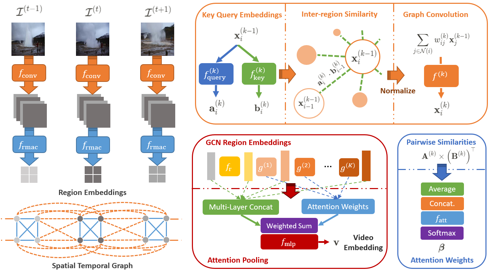

# Video Region Attention Graph (VRAG) for Video Retrieval

## Setting up

### System details

```
NVIDIA CUDA v10.1
NVIDIA GTX 1080Ti
Ubuntu 18.04
Python v3.7.6
```

### Installation

```
conda create -n vrag python==3.7.6
conda install pytorch==1.6.0 torchvision==0.7.0 cudatoolkit=10.1 -c pytorch
pip install -r requirements.txt
```

#### Package installation 
Alternatively, you can perform a package installation:
```bash
pip install VRAG/  # where VRAG is the root directory of the project.
```
Example usage as package:
```python
from vrag.directory import PROJECT_DIR
print(PROJECT_DIR)  # prints out the project directory
```

### Linking directories

We will set paths using the environment variables, similar to the example below:

```bash
export VRAG_PATH_PROJECT_DIR="/mnt/BigData/projects/VRAG"
export VRAG_PATH_CCWEB_DIR="/mnt/BigData/video-retrieval-datasets/cc-web-video"
export VRAG_PATH_EVVE_DIR="/mnt/HGST6/video-retrieval-datasets/evve"
export VRAG_PATH_FIVR5K_DIR="mnt/HGST6/video-retrieval-datasets/fivr5k"
export VRAG_PATH_FIVR200K_DIR="mnt/BigData/video-retrieval-datasets/fivr200k"
export VRAG_PATH_VCDB_DIR="/mnt/WD6/vcdb"
export VRAG_PATH_VCDB_DISTRACTOR_DIR="/mnt/WD6/vcdb-distractors"
export VRAG_PATH_TRAIN_DATA_DIR="/mnt/HGST6/video-retrieval-datasets/video-retrieval-train"
export VRAG_PATH_CONFIG_DIR='/mnt/BigData/projects/VRAG/configs'
export VRAG_PATH_LOG_DIR='/mnt/BigData/projects/VRAG/logs'
export VRAG_PATH_RESULT_DIR='/mnt/BigData/projects/VRAG/results'
```

### Dataset directory setup

#### CC_WEB_VIDEO

In `src/directory.py`, set `CCWEB_DIR` to point the root directory for the CC_WEB_VIDEO dataset. The initial structure 
of the dataset contain the following:
```
[CC_WEB_VIDEO ROOT DIR]/
    - videos/  # download videos from http://vireo.cs.cityu.edu.hk/webvideo/
    - cc_web_video.pickle  # download from https://github.com/MKLab-ITI/visil/blob/master/datasets/cc_web_video.pickle
```

#### EVVE

In `src/directory.py`, set `EVVE_DIR` to point the root directory for the EVVE dataset. The initial structure 
of the dataset contain the following:
```
[EVVE ROOT DIR]/
    - videos/  # download videos from http://pascal.inrialpes.fr/data/evve/
    - annots/  # download videos from http://pascal.inrialpes.fr/data/evve/
```
EVVE has video subfolders, extract the videos from each subfolder into `[EVVE ROOT DIR]/videos`.

#### FIVR200K

In `src/directory.py`, set `FIVR200K_DIR` to point the root directory for the FIVR200K dataset. The initial structure 
of the dataset contain the following:
```
[FIVR200K ROOT DIR]/
    - videos/  # download from https://github.com/MKLab-ITI/FIVR-200K
    - annotations.json  # download from https://github.com/MKLab-ITI/FIVR-200K
```

#### FIVR5K

In `src/directory.py`, set `FIVR5K_DIR` to point the root directory for the FIVR5K dataset. The initial structure 
of the dataset contain the following:
```
[FIVR5K ROOT DIR]/
    - videos/  # extract the relevant videos from FIVR200K.
    - db-videos.txt  # list of database videos
    - query-videos.txt   # list of query videos
    - videos.txt  # list of all videos
    - annotations.json  # shared with FIVR200K.
```
We provide the auxiliary files, e.g. `db-videos.txt` [here](https://drive.google.com/drive/folders/1RFZweBRjGOsn2e1eNDolTK9orUUgNwev?usp=sharing).

#### VCDB
In `src/directory.py`, set `VCDB_DIR` to point the root directory for the VCDB dataset. The initial structure 
of the dataset contain the following:
```
[VCDB_DISTRACTORS ROOT DIR]/
    - annotation  # download from http://www.yugangjiang.info/research/VCDB/index.html
    - videos/   # download from http://www.yugangjiang.info/research/VCDB/index.html
```


#### VCDB distractors

In `src/directory.py`, set `VCDB_DISTRACTOR_DIR` to point the root directory for the VCDB DISTRACTORS dataset. The initial structure 
of the dataset contain the following:
```
[VCDB_DISTRACTORS ROOT DIR]/
    - videos/   # download from http://www.yugangjiang.info/research/VCDB/index.html
```

#### VCDB distractors

### Extracting R-MAC features

To extract R-MAC features, run the following script:
```bash
cd src
python scripts/extract_rmac_features.py --dataset evve --device 0
```
where the dataset options are `['vcdb', 'vcdb-distractors', 'ccweb', 'evve', 'fivr5k', 'fivr200k']`. We also provide 
extracted R-MAC features for [EVVE](https://drive.google.com/file/d/1nj9KQZ2PvyjqPvFgFILiy32seSgEBabA/view?usp=sharing) 
and [FIVR-5K](https://drive.google.com/file/d/19ZdySIuGmQHDj7KgLBvtxYauXjqMuTEa/view?usp=sharing). Unzip the `rmac.zip` 
for the datasets and save them into `[EVVE_DATA_DIR]/frame-features/rmac` and `[FIVR200k-DATA-DIR]/frame-features/rmac` respectively.
## Training

### Training setup

For training VRAG, ensure that the `vcdb` and `vcdb-distractors` features are created. We generate the annotations for 
training in `src/data/datasets/train.py`. The `TRAIN_DATA_DIR` in `src/directory.py` folder should contain the following:
```
[TRAIN_DATA_DIR]
    - annotations/  # created from running src/data/datasets/train.py
        - lbow/  # contains annotations using LBoW from ViSiL
            - normal/
            - augmented/
        - train/  # contains sampled normal/augmented triplet details for each epoch.
            - normal/
            - augmented/
    - triplets.pk  # refer to http://ndd.iti.gr/visil/triplets.pk
    - video-index.pk  # created from running src/data/datasets/train.py
``` 
We provide our auxiliary files for training [here](https://drive.google.com/drive/folders/1FF0fXpbHvLjCtJIw7xDMhcgtxChyXp99?usp=sharing).


### Running training script

The training script can be run using `src/scripts/train.py`
```
cd src
python scripts/train.py --config submission --device 0
```
where `submission` refers to `configs/submission.json`. The checkpoints and logs will be stored in 
`checkpoints/submission/` and `logs/submission/` respectively. In our training, we select the model with the best FIVR5K 
DSVR mAP i.e. the model at epoch 110, `model-110`.  Ensure that the R-MAC features for `vcdb`, `vcdb-distractors`, `evve` 
and `fivr5k` are extracted before running the training script. We provide our pre-trained model 
[here](https://drive.google.com/drive/folders/1GLYFbySWlb1LkIveMNcpnjaMMkDOOdp6?usp=sharing). Save the pre-trained model as `checkpoints/submission/model-110.pt`

## Inference

For inference, please extract the R-MAC features for the relevant datasets first.

### Video-level embeddings 

Video-level embeddings can be generated using `src/scripts/create_video_embeddings.py`:
```
cd src
python scripts/create_video_embeddings.py --config submission --dataset evve --device 0 --checkpoint model-110
```
which creates video-level embeddings in `[PROJECT_DIR]/results/evve/embeddings/`.

To evaluate video-level embeddings, use `src/scripts/create_video_embeddings.py`:
```
python scripts/evaluate_video_embeddings.py --config submission --dataset evve
```
which creates the file containing video similarities in `[PROJECT_DIR]/results/evve/similarities.json`. For EVVE, 
you may use [eval_evve.py](http://pascal.inrialpes.fr/data/evve/eval_evve.py) from the EVVE authors as well by converting the similarities file into a ranking file.

For Average Query Expansion (AQE) on EVVE, run:
```
python scripts/evaluate_evve_aqe.py --config submission
```

### Shot-level Embeddings
Shot-level embeddings can be generated using `src/scripts/create_video_shot_embeddings.py`:
```
cd src
python scripts/create_video_shot_embeddings.py --config submission --dataset evve --device 0 --checkpoint model-110 --threshold 0.75
```
which creates video-level embeddings in `[PROJECT_DIR]/results/evve/shot-embeddings-75/` where `--threshold` specifies the cosine similarity threshold for the shot boundary algorithm.

To evaluate video-level embeddings, use `src/scripts/create_video_embeddings.py`:
```
python scripts/evaluate_video_shot_embeddings.py --config submission --dataset evve --threshold 0.75
```


